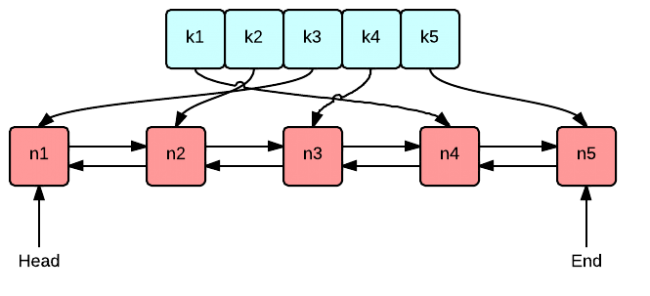

## 面试题

Redis 的过期策略都有哪些？内存淘汰机制都有哪些？手写一下 LRU 代码实现？

## 面试官心理分析

如果你连这个问题都不知道，上来就懵了，回答不出来，那线上你写代码的时候，想当然的认为写进 Redis 的数据就一定会存在，后面导致系统各种 bug，谁来负责？

常见的有两个问题：

-   往 Redis 写入的数据怎么没了？

可能有同学会遇到，在生产环境的 Redis 经常会丢掉一些数据，写进去了，过一会儿可能就没了。我的天，同学，你问这个问题就说明 Redis 你就没用对啊。Redis 是缓存，你给当存储了是吧？

啥叫缓存？用内存当缓存。内存是无限的吗，内存是很宝贵而且是有限的，磁盘是廉价而且是大量的。可能一台机器就几十个 G 的内存，但是可以有几个 T 的硬盘空间。Redis 主要是基于内存来进行高性能、高并发的读写操作的。

那既然内存是有限的，比如 Redis 就只能用 10G，你要是往里面写了 20G 的数据，会咋办？当然会干掉 10G 的数据，然后就保留 10G 的数据了。那干掉哪些数据？保留哪些数据？当然是干掉不常用的数据，保留常用的数据了。

-   数据明明过期了，怎么还占用着内存？

这是由 Redis 的过期策略来决定。

## 面试题剖析

### Redis 过期策略

Redis 过期策略是：**定期删除+惰性删除**。

所谓**定期删除**，指的是 Redis 默认是每隔 100ms 就随机抽取一些设置了过期时间的 key，检查其是否过期，如果过期就删除。

假设 Redis 里放了 10w 个 key，都设置了过期时间，你每隔几百毫秒，就检查 10w 个 key，那 Redis 基本上就死了，cpu 负载会很高的，消耗在你的检查过期 key 上了。注意，这里可不是每隔 100ms 就遍历所有的设置过期时间的 key，那样就是一场性能上的**灾难**。实际上 Redis 是每隔 100ms **随机抽取**一些 key 来检查和删除的。

但是问题是，定期删除可能会导致很多过期 key 到了时间并没有被删除掉，那咋整呢？所以就是惰性删除了。这就是说，在你获取某个 key 的时候，Redis 会检查一下 ，这个 key 如果设置了过期时间那么是否过期了？如果过期了此时就会删除，不会给你返回任何东西。

> 获取 key 的时候，如果此时 key 已经过期，就删除，不会返回任何东西。

但是实际上这还是有问题的，如果定期删除漏掉了很多过期 key，然后你也没及时去查，也就没走惰性删除，此时会怎么样？如果大量过期 key 堆积在内存里，导致 Redis 内存块耗尽了，咋整？

答案是：**走内存淘汰机制**。

### 内存淘汰机制

Redis 内存淘汰机制有以下几个：

-   noeviction: 当内存不足以容纳新写入数据时，新写入操作会报错，这个一般没人用吧，实在是太恶心了。
-   **allkeys-lru**：当内存不足以容纳新写入数据时，在**键空间**中，移除最近最少使用的 key（这个是**最常用**的）。
-   allkeys-random：当内存不足以容纳新写入数据时，在**键空间**中，随机移除某个 key，这个一般没人用吧，为啥要随机，肯定是把最近最少使用的 key 给干掉啊。
-   volatile-lru：当内存不足以容纳新写入数据时，在**设置了过期时间的键空间**中，移除最近最少使用的 key（这个一般不太合适）。
-   volatile-random：当内存不足以容纳新写入数据时，在**设置了过期时间的键空间**中，**随机移除**某个 key。
-   volatile-ttl：当内存不足以容纳新写入数据时，在**设置了过期时间的键空间**中，有**更早过期时间**的 key 优先移除。

### 手写一个 LRU 算法

LRU 就是 Least Recently Used 的缩写，翻译过来就是“最近最少使用”。也就是说 LRU 算法会将最近最少用的缓存移除，让给最新使用的缓存。而往往最常读取的，也就是读取次数最多的，所以利用好 LRU 算法，我们能够提供对热点数据的缓存效率，能够提高缓存服务的内存使用率。

那么如何实现呢？

其实，实现的思路非常简单，就像下面这张图种描述的一样。


你可以现场手写最原始的 LRU 算法，那个代码量太大了，似乎不太现实。

不求自己纯手工从底层开始打造出自己的 LRU，但是起码要知道如何利用已有的 JDK 数据结构实现一个 Java 版的 LRU。



```java
public class LRUCache<K, V> extends LinkedHashMap<K, V> {
    private int capacity;

    /**
     * 传递进来最多能缓存多少数据
     *
     * @param capacity 缓存大小
     */
    public LRUCache(int capacity) {
        super(capacity, 0.75f, true);
        this.capacity = capacity;
    }

    /**
     * 如果map中的数据量大于设定的最大容量，返回true，再新加入对象时删除最老的数据
     *
     * @param eldest 最老的数据项
     * @return true则移除最老的数据
     */
    @Override
    protected boolean removeEldestEntry(Map.Entry<K, V> eldest) {
        // 当 map中的数据量大于指定的缓存个数的时候，自动移除最老的数据
        return size() > capacity;
    }
}
```
